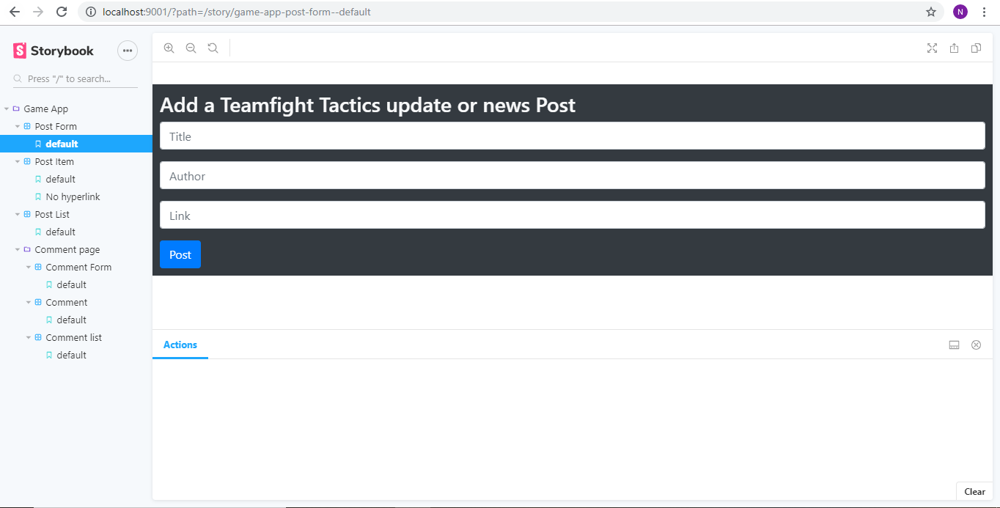

# BSc (Hons.) Level 8 - Assignment 1 - Single Page app.

Name: Niall Murphy

## Overview.

The concept of this app is to be a news/update forum for the game 'Teamfight Tactics' allowing visitors to post and upvote posts on the site. It is designed to be an easy ay to keep up to date on the community by being able to see most popular posts quick and easily. Links from the posts brings the users to the main article/post that the ost references. Also allows visitors to post comments under posts and upvote other comments on posts. 

. . . . . List of user features  . . . .

- Post an update with a Title, Link to news/update, and name of poster.
- Upvote posts
- Leave comments under posts
- Upvote comments

## Setup.

First go to the main 'Assignment1' folder in a terminal and install 'npm install'. To start the storybook server use the command 'npx start-storybook -p 9001 -c .storybook/' in a termianl in the 'Assignnment1' folder directory. And to launch the create-react-app development server ue the command 'npm start' in the same directory again. 

## Data Model Design.

Diagram of app's data model included. 

## UI Design.

The main page, where posts can be submitted to the site. Post can also be upvoted here and comments can be leeft on the posts. Clicking on comments brings you to the comments page where they can be left and other comments can be upvoted. 

## Routing.

Route from main page to comments page by selecting any of the comments buttons (to the left of each post), also route from comments page back to the main app page by selecting the 'Teamfight Tactics Updates and News' text on the top of the page. All views are public and do not require authentication.

- /articles (public)- displays all published articles - title and author only.
- /articles/:id (private) - detail view of a particular article.
+ /articles/:author:id - display all articles by a specific author.
- etc
- etc

## Storybook.

Screenshot included of expanded Storybook.

## Independent learning attempt

I researched how to add a login/signup page so that I coould have users for the app but I was unfortunately unable to get this to work.

[model]: ./img/model.PNG
[main]: ./img/main.PNG
[detail]: ./img/detail.PNG
[stories]: ./img/stories.PNG
